# Partie 1 — Les bases 🟢

## Exercice 1 — Premier contact avec Docker 

### 1.1 __Téléchargez l'image nginx:alpine depuis Docker Hub sans lancer de conteneur.__

Pour ce faire, nous utilisons Docker Desktop et allons dans l'onglet docker Hub puis, dans la barre de recherche nous tapons `nginx`. Il nous propose plusieurs versions, nous prenons la plus récente.

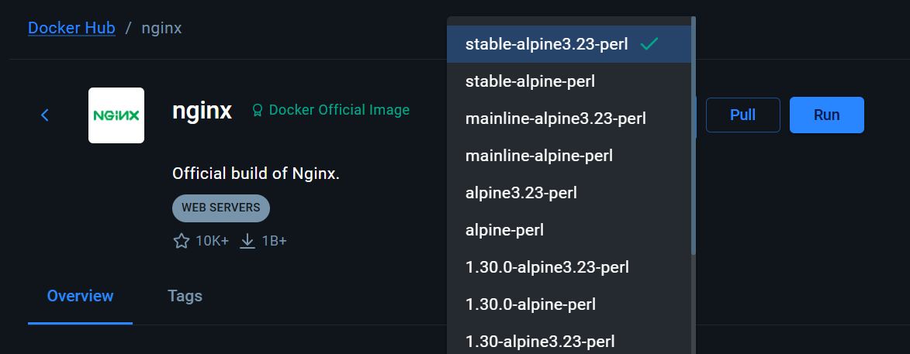

---

### 1.2 __Lancez un conteneur nginx:alpine nommé mon-nginx en arrière-plan, en exposant le port 8080 de votre machine sur le port 80 du conteneur.__

L'idée ici est de runner le container avec l'image précédente et la nommer "mon-nginx" puis de cliquer sur le bouton `Run`

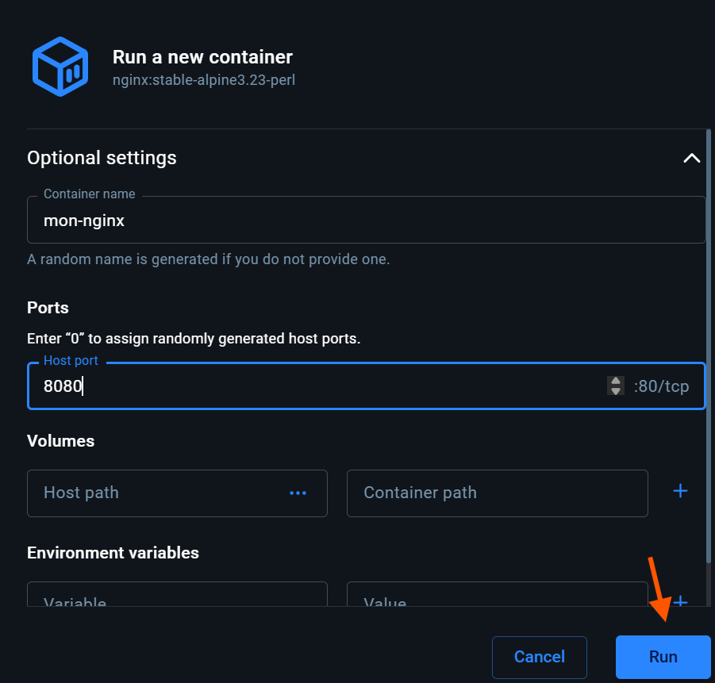

---

### 1.3 __Vérifiez que le conteneur tourne. Quelle commande permet de lister uniquement les conteneurs en cours d'exécution ?__

On peut trouver facilement la commande qui permet de liser uniquement les ocnteneurs en cours d'exécution. La commande qui permet cela est `docker ps`

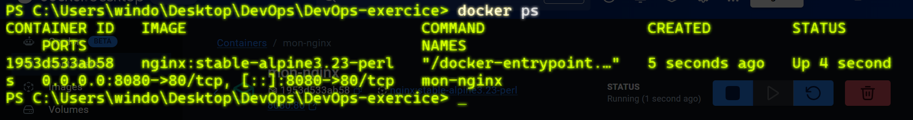

---

### 1.4 __Ouvrez `http://localhost:8080` dans votre navigateur (ou avec curl ). Que voyez-vous ?__

Nous pouvons voir une page Nginx prouvant que le conteneur Docker est bien lancé et que le serveur web Nginx fonctionne correctement à l'intérieur.

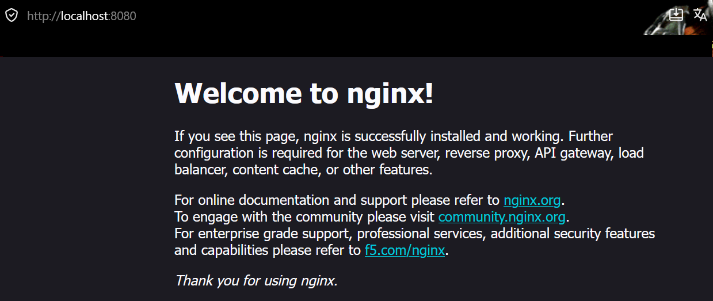

---

### 1.5 __Affichez les logs du conteneur mon-nginx.__

Les logs sont accessibles en cliquant directement sur le nom du container. 

---

### 1.6 __Arrêtez le conteneur mon-nginx sans le supprimer. Puis listez tous les conteneurs (y compris arrêtés). Quelle est la différence avec la commande de la question 1.3 ?__

Pour arrêter le container, nous tapons dans le terminal `docker stop mon-nginx`. Pour vérifier `TOUS` les containers, y compris ceux qui sont arrêtés, comme la commande suite à la question 1.3, nous pouvons trouver cette dernière rapidement suite à une recherche web. Nous devons ajouter le paramètre `-a` dans la commande. Cela donne `docker ps -a`. 

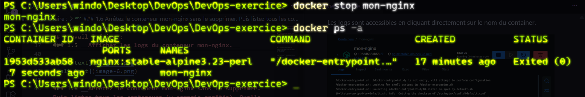

---

### 1.7 __Supprimez le conteneur mon-nginx . Vérifiez qu'il n'existe plus.__

La commande `docker rm mon-nginx` permet de supprimer le container. On vérifie en tapant la commande vue précédemment : `docker ps -a`. On peut voir qu'aucuns containers ne s'affiche, ce dernier a bien été supprimé.

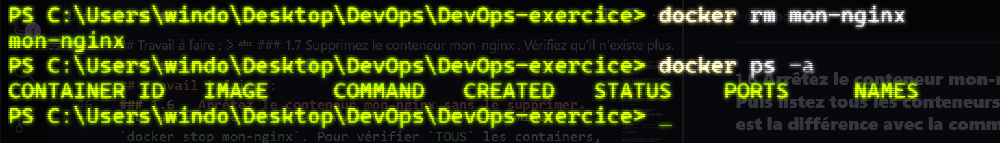

---

### 1.8 __Quelle commande aurait permis de lancer le conteneur de façon à ce qu'il soit automatiquement supprimé à l'arrêt ?__

La commande qui permet de lancer un container puis qu'il se supprime automatiquement une fois stoppé est : `docker run --rm <image>`

## Exercice 2 — Construire sa première image avec un Dockerfile 

### 2.1 __Écrivez index.html avec le contenu HTML minimal suivant (titre : "Ma première image Docker" , un `h1` avec votre prénom).__

A des fins de praticité, dans VSCode il suffira de taper `!` afin qu'il nous ajoute automatiquement un squelette de base avec toutes les balises minimales `HTML`. Nous n'avons plus qu'à remplir le `title` et créer le `H1` dans le `body`.

---

### __2.2 Écrivez un Dockerfile qui :__
- __Part de l'image nginx:alpine__
- __Copie index.html dans /usr/share/nginx/html/index.html__
- __Expose le port 80__

---

### 2.3 __Construisez l'image avec le tag mon-site:v1.__

On rentre la commande `docker build -t <tag> .` dans le terminal.

--- 

### 2.4 __Lancez un conteneur basé sur cette image, en exposant le port 9090 → 80 , avec --rm . Vérifiez dans le navigateur.__

Pour ce faire, nous utilisons la commande suivante : `docker run --rm -d -p 9090:80 --name mon-site mon-site:v1`

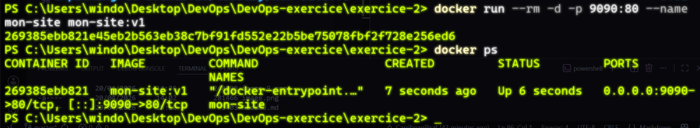

Après vérification dans le navigateur, nous pouvons voir que le `H1` de notre fichier `HTML` s'exécute correctement.

---

### 2.5 __Listez les images locales. Quelle est la taille de mon-site:v1 ? Comparez avec nginx:alpine.__

On peut lister les images avec `docker images`. Avec cette commande, nous avons accès à plusieurs informations dont la taille. `mon-site:nginx` est plus légère que `nginx:alpine` de plusieurs dizaine de MB ce qui est plutôt significatif.

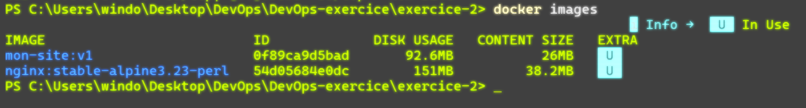

---

### 2.6 __Inspectez les layers de l'image avec `docker history mon-site:v1`. Combien de layers ont été ajoutés par rapport à l'image de base ?__

On peut voir que __2 layers__ on été ajoutés par rapport à l'image de base. `EXPOSE` et `COPY`.

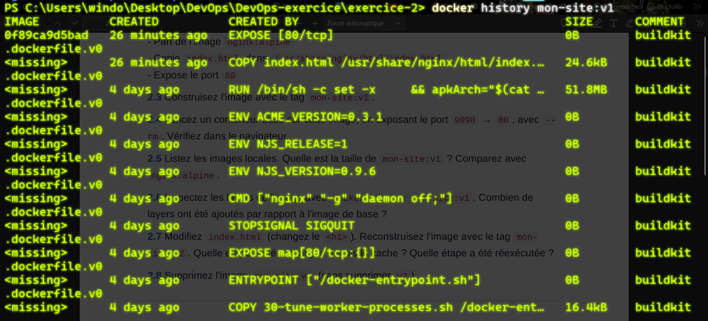

---

### 2.7 __Modifiez `index.html` (changez le `<h1>` ) Reconstruisez l'image avec le tag `mon-site:v2`. Quelle étape a été rechargée depuis le cache ? Quelle étape a été réexécutée ?__

Après avoir modifié le `H1` du fichier `index.html` on reconstruit l'image en tapant la même commande que précédement mais en remplaçant le nom : `docker build -t mon-site:v2`

L'image de base nginx:alpine n'a pas changé. Docker réutilise le cache. 

Le fichier index.html a été modifié et Docker a réexécuté le COPY.

---

### 2.8 __Supprimez l'image mon-site:v1 (sans supprimer v2 ).__

Pour supprimer l'image `mon-site:v1` nous faisons `docker rmi mon-site:v1`.

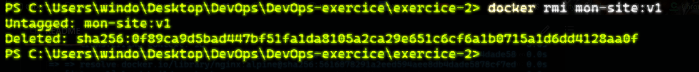

---

## Exercice 3 — Volumes et persistance des données

### 3.1 __Lancez un conteneur alpine en mode interactif ( -it ) avec --rm . À l'intérieur, créez le fichier /data/test.txt avec le contenu "bonjour" . Quittez ( exit ). Relancez un nouveau conteneur alpine . Le fichier existe-t-il ? Expliquez pourquoi.__

On lance le container avec la commande `docker run -it --rm alpine`. Docker va télécharger automatiquement l'image depuis la librairie. Une fois terminé, nous accédons au shell dans lequel nos pouvons entrer les commandes et créer notre fichier `test.txt`.

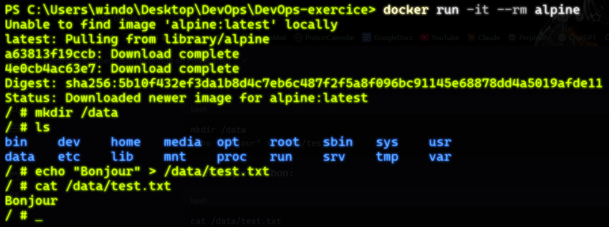

Comme nous pouvons le constater, après avoir quitté le container et relancé ce dernier, le dossier `data` n'existe plus car Docker, de base, repart sur une image vierge si on ne lui précise pas que l'on peut faire persister les données.

---

### 3.2 __— Bind mount : Créez un dossier exercice-3/html/ sur votre machine. Placez-y un fichier index.html . Lancez un conteneur nginx:alpine en montant ce dossier dans / usr/share/nginx/html avec -v . Modifiez index.html sur votre machine (sans redémarrer le conteneur) et rafraîchissez le navigateur. Que constatez-vous ?__

On tape la commande correspondante pour lancer le fichier que l'on vient de créer.

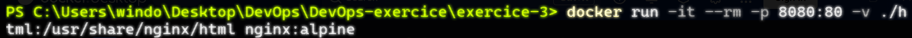

On peut voir que cela fonctionne bien et que notre `HTML` s'affiche bien.

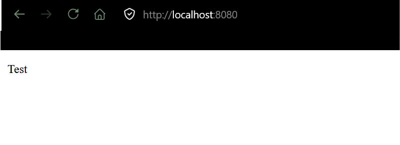

Suite à la modification du code `HTML`, après avoir rafraîchi le navigateur, nous pouvons constater que la modification est effective et immédiate.

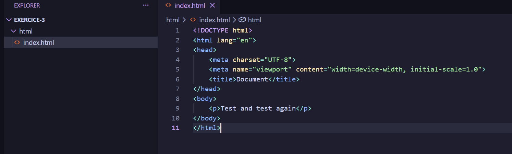

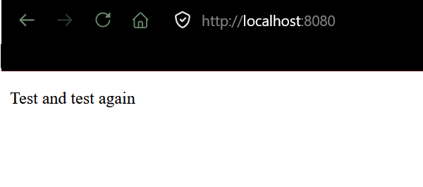

---

### 3.3 __— Volume nommé : Créez un volume Docker nommé mes-donnees.__

Nous créons le volume avec la commande suivante :

---

### 3.4 __Lancez un conteneur alpine avec --rm en montant mes-donnees sur /data . Dans le conteneur, créez /data/persistant.txt avec le contenu "je survis". Quittez.__

Nous utilisons la commande suivante pour ce faire : 

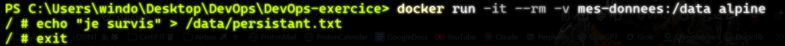

---

### 3.5 __Lancez un nouveau conteneur alpine (différent du précédent) avec le même volume monté. Le fichier /data/persistant.txt existe-t-il ? Qu'est-ce que cela démontre ?__

Après avoir relancé un nouveau container avec le même volume monté, nous pouvons voir que le fichier `persistant.txt` existe toujours. Cela démontre que contrairement aux bind mounts, le volume nommé persiste indépendamment des conteneurs. Même après la suppression du conteneur (`--rm`), les données survivent car elles sont stockées par Docker, pas dans le conteneur. 

_PS: merci d'omettre la faute de frappe_ 😁

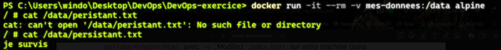

---

### 3.6 __Listez les volumes Docker existants. Où Docker stocke-t-il physiquement ce volume sur votre machine ?__

Pour lister les volumes Docker existant, il suffit de taper la commande `docker volume ls`. Nous pouvons voir que le volume précédemment créé et disponible. Une fois ceci fait, pour vérifier l'emplacement du volume nous faisons : `docker volume inspect mes-donnees`. Nous recevons un tableau d'objet en `JSON` avec l'information du `MountPoint`.

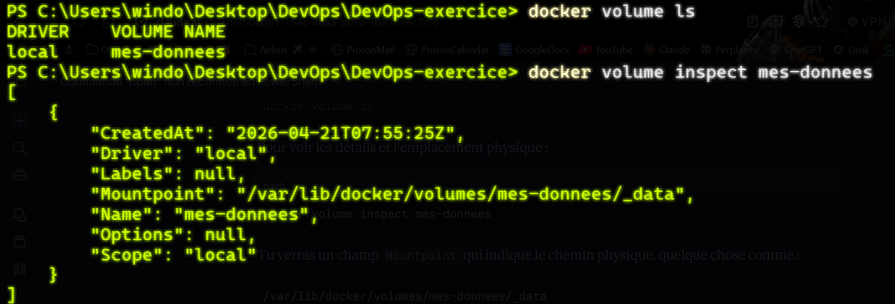

---

### 3.7 __Supprimez le volume mes-donnees . Quelle précaution faut-il prendre avant de le supprimer ?__

Pour supprimer un volume Docker, la commande est : `docker volume rm mes-donnes`. Dans l'idéal, il faut s'assurer qu'aucun conteneur n'utilise le volume avant de le supprimer, sinon Docker refusera. ⚠️ Et surtout, la suppression est irréversible. Toutes les données dedans sont perdues définitivement.⚠️

_PS: merci d'omettre l'oublie de `ls`'_ 😁

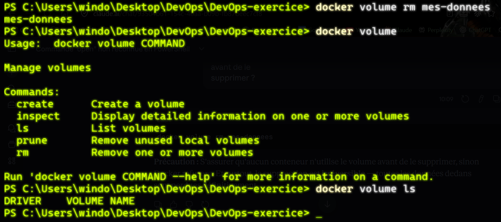

---

## Exercice 4 — Réseaux Docker

### 4.1 __Listez les réseaux Docker existants sur votre machine. Quels sont les trois réseaux créés par défaut ?__

Pour lister les réseaux créés par défaut, il faut taper la commande : `docker network ls`

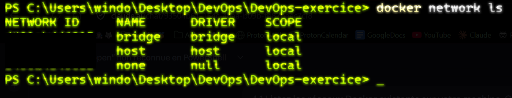

---

### 4.2 __Créez un réseau bridge personnalisé nommé mon-reseau.__

Voici la commande : `docker network create mon-reseau`

---

### 4.3 __Lancez un conteneur `nginx:alpine` nommé `serveur-web` connecté à `mon-reseau`, en arrière-plan.__

Voici la commande : `docker run -d --name serveur-web --network mon-reseau nginx:alpine`

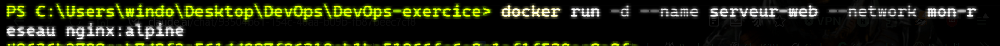

---

### 4.4 __Lancez un conteneur alpine nommé client connecté à `mon-reseau` en mode interactif. Depuis client , effectuez un `wget -qO- http://serveur-web`. Que récupérez-vous ? Pourquoi peut-on utiliser le nom serveur-web plutôt qu'une adresse IP ?__

On lance le container avec la commande : `docker run -it --rm --name client --network mon-reseau alpine`. On peut utiliser le nom `serveur-web` car Docker intègre un DNS automatique dans les réseaux personnalisés. Il résout automatiquement le nom du conteneur en son adresse IP.

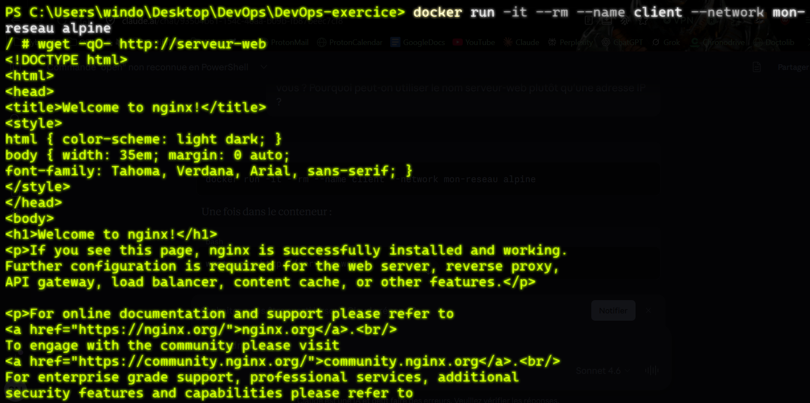

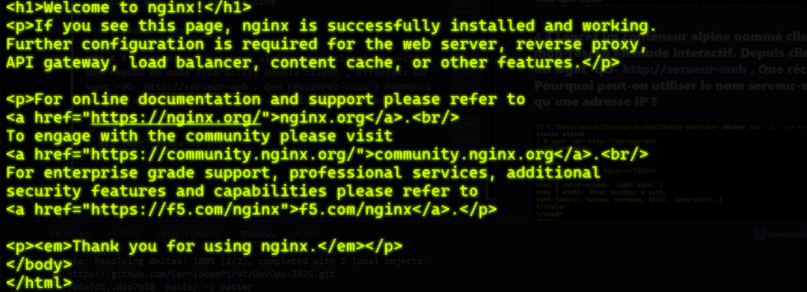

---

### 4.5 __Quittez client. Lancez un nouveau conteneur alpine nommé client-externe sans le connecter à mon-reseau (réseau par défaut). Essayez de joindre serveur-web par son nom. Que se passe-t-il ? Pourquoi ?__

Pour lancer le nouveau container : `docker run -it --rm --name client-externe alpine`. Lorsqu'on essaye de joindre le serveur `serveur-web` nous obtenons une erreur. En effet, le réseau de `client-externe` est en mode `bridge` et est donc isolé de `mon-reseau`.

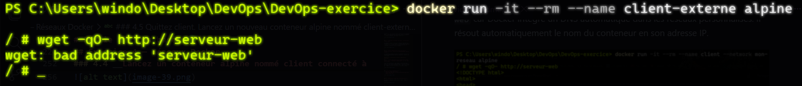

---

### 4.6 __Quelle commande permet de connecter client-externe à mon-reseau après son démarrage ?__

Voici la commande : `docker network connect mon-reseau client-externe`

---

### 4.7 __Nettoyez : arrêtez et supprimez tous les conteneurs créés dans cet exercice, puis supprimez mon-reseau.__

Voici les commandes pour arrêter, supprimer les containers ainsi que `mon-reseau` : 

`docker stop serveur-web client-externe`

`docker rm serveur-web client-externe`

`docker network rm mon-reseau`

On vérifie que tout est bien supprimé avec `docker ps` et `docker network ls` : 

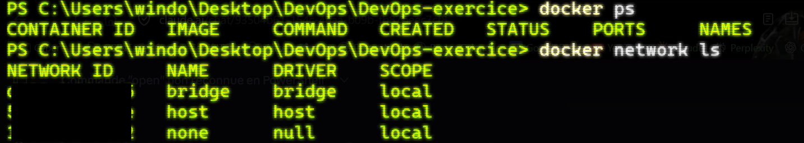

---

## Exercice 5 — Containeriser un serveur Flask

### 5.1 __Créez `app.py` :__

Dans VS Code, on crée le fichier `app.py` puis on colle le code fourni.

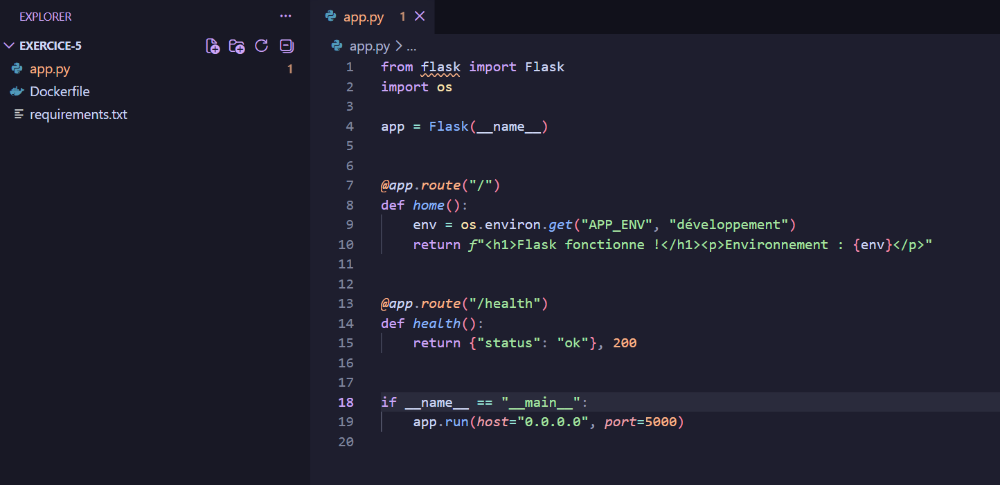

---

### 5.2 __Créez requirements.txt avec Flask 3.0.3 comme unique dépendance__

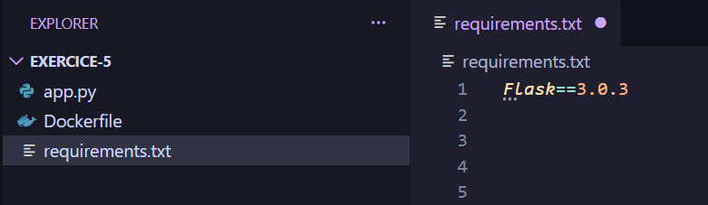

---

### 5.3 __Écrivez un Dockerfile qui :__
- __Part de python:3.12-slim__
- __Définit /app comme répertoire de travail__
- __Copie d'abord requirements.txt seul, installe les dépendances (sans cache pip), puis copie le reste des sources. Pourquoi cet ordre est-il important pour le cache Docker ?__
- __Expose le port 5000__
- __Définit la commande de démarrage avec flask run --host=0.0.0.0__

On écrit le `Dockerfile`. L'ordre est important car Docker construit les images couche par couche. Ainsi, l'ordre est primordial afin de ne pas devoir tout rebuild si un changement a lieu.

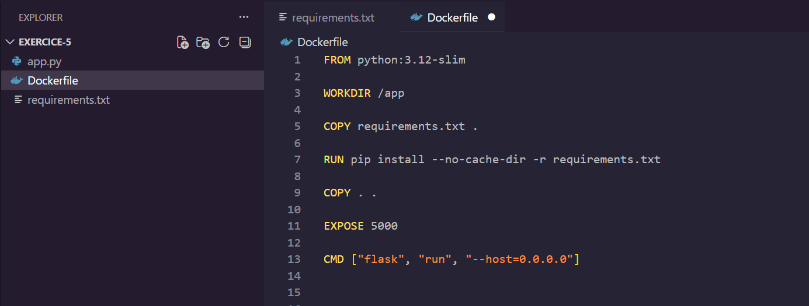

---

### 5.4 __Construisez l'image flask-app:v1.__

On utilise la commande `docker build -t flask-app:v1`

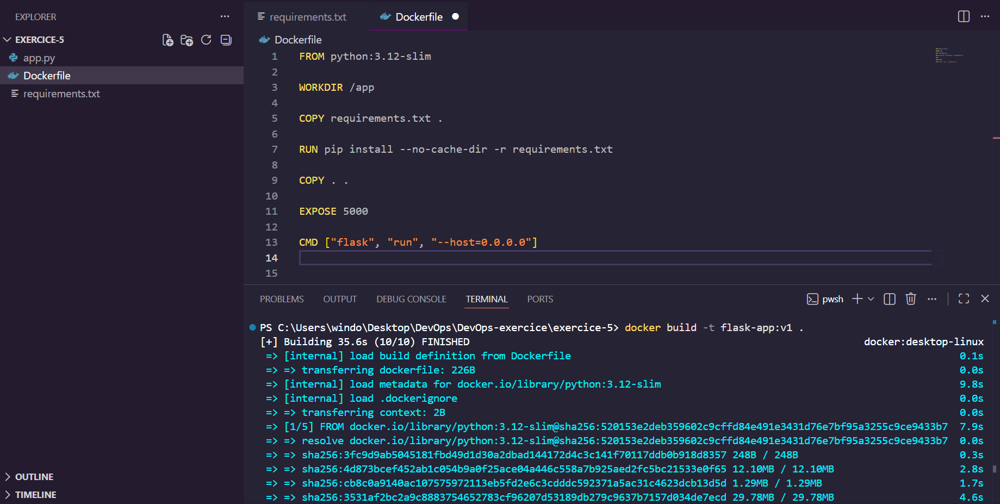

---

### 5.5 __Lancez un conteneur en passant la variable d'environnement APP_ENV=production et en exposant le port 5000 . Vérifiez / et /health dans le navigateur ou avec curl.__

Voici la commande de lancement du contenair : `docker run -d --name mon-app -e APP_ENV=production -p 5000:5000 flask-app:v1`

Une fois le container lancé, nous ouvrons `http://localhost:5000` et pouvons voir que le fichier `app.py` est bien fonctionnel et nous affiche `production`.

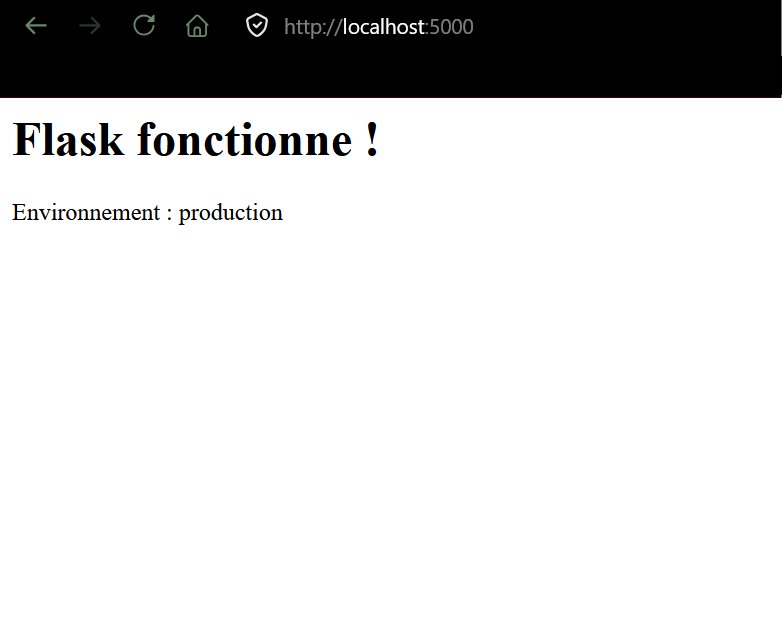

Nous allons maintenant sur la route `/health` et obtenons bien le statut `ok` qui nous confirme que tout fonctionne. 

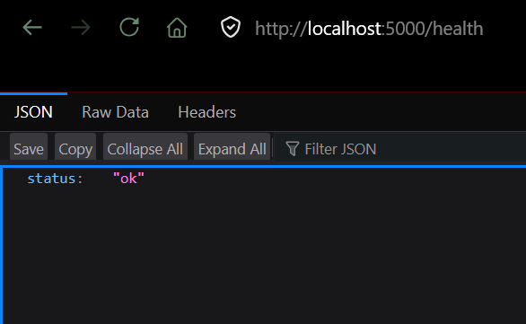

---

### 5.6 __Relancez le conteneur sans passer APP_ENV . Quelle valeur s'affiche ? D'où vient-elle ?__

Avant de relancer le container, on le stop et le supprime avec la commande : `docker stop mon-app && docker rm mon-app`. 

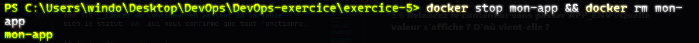

Une fois que cela est fait, on le relance sans lui passer la variable d'environnement `APP_ENV`. 

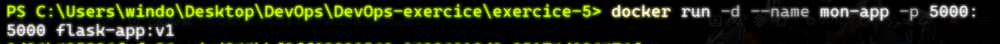

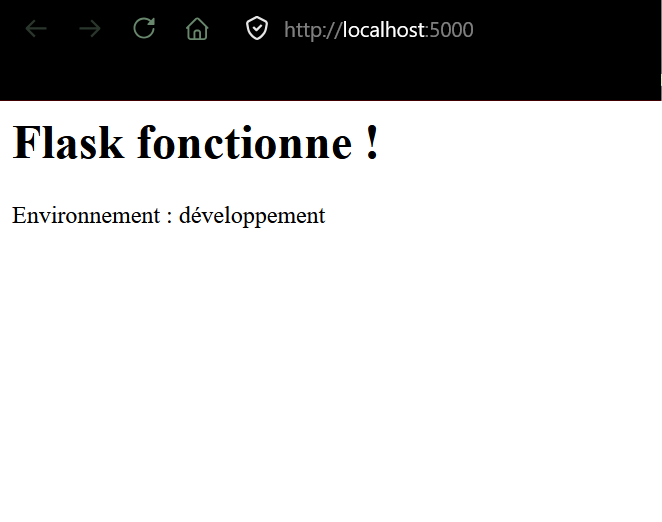

On peut voir que le code fourni dans `app.py` est bien fonctionnel. Le valeur par défaut de la variable d'environnement est affichée. 

---

### 5.7 __Quelle est la taille de l'image flask-app:v1 ? Que pourrait-on faire pour la réduire davantage (donnez deux pistes) ?__

Pour vérifier la taille de l'image, nous faisons la commande : `docker images` et pouvons voir que le `DISK USAGE` est de `197MB`.

Première option : On change l'image `python:3.12-slim` par `python:3.12-alpine` qui est plus légère. _{Pour le rebuild, j'ai appellé la nouvelle version `v2` afin d'avoir un visuel de comparatif.}_

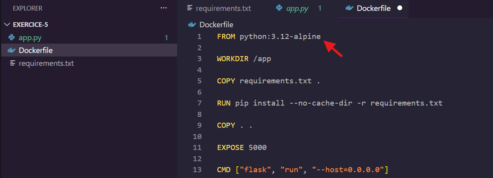

Une fois le rebuild fait, on tape la commande : `docker build -t flask-app:v2`.

Maintenant, comparons les deux images avec la commande : `docker images flask-app`

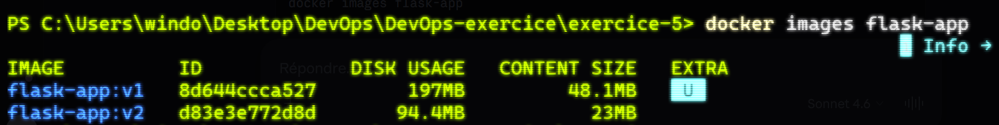

Déjà, nous pouvons voir une baisse significative de la taille de l'image. Elle est passée de `197MB` à `94.4MB`. Maintenant, essayons de rajouter le fichier `.dockerignore` qui sert à ignorer certains fichiers non essentiels lors du build.

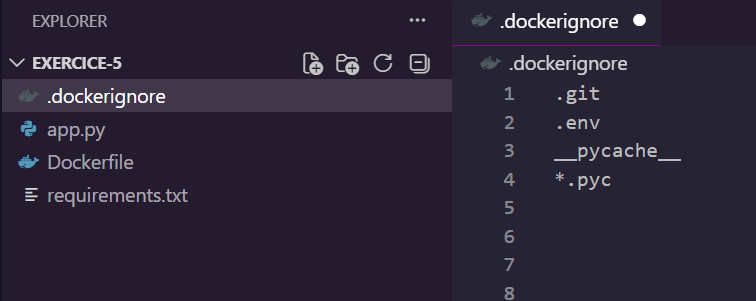

Maintenant recompilons le tout et voyons la différence entre les trois versions.

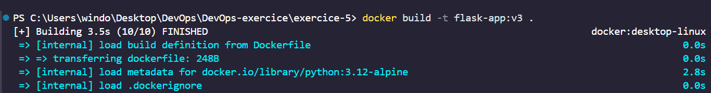

Voyons le résultat : 

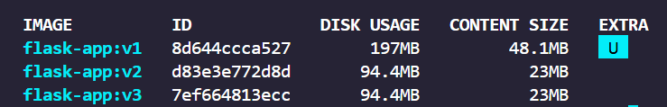

Malheuresement, dans ce projet, l’effet est négligeable car peu de données sont présentent, mais sur des projets volumineux, `.dockerignore` peut réduire significativement la taille de l’image et accélérer le build.

