# Module 1 - Prometheus

## Exercice 1 : Installer Prometheus et accéder à l'interface web

> *Lancer un seul conteneur Prometheus, accéder à l'interface web sur le port 9090 et vérifier que Prometheus se scrape lui-même.*

### 1.1 Récupérer l'image : docker pull prom/prometheus:latest

Pour faire cela, nous lancons `Docker Desktop` puis tapons la commande suivante dans le terminal : `docker pull prom/prometheus:latest`

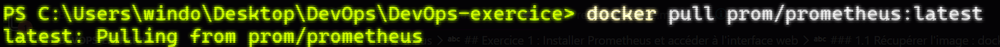

---

### 1.2 La lancer : docker run -d --name prometheus -p 9090:9090 prom/prometheus:latest

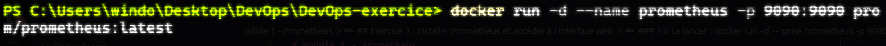

---

### 1.3 Ouvrir http://localhost:9090 dans votre navigateur

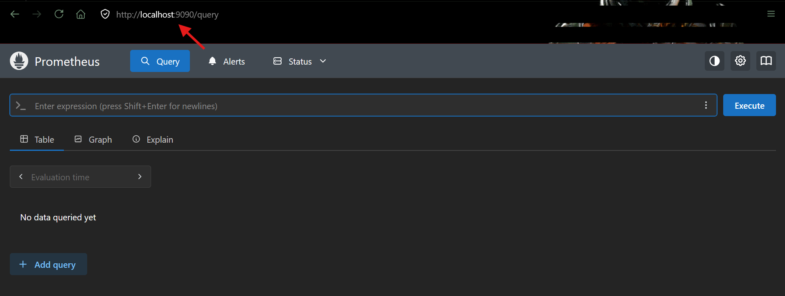

---

### 1.4 Aller dans Status > Targets et confirmer que la cible prometheus est UP

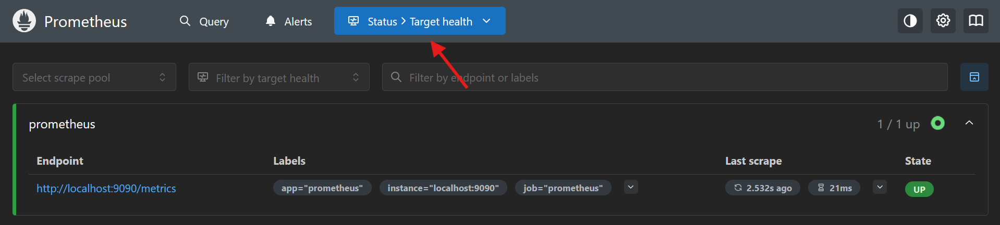

---

## 1.5 Exécuter docker logs prometheus et lire la ligne de démarrage qui annonce le répertoire de stockage

Pour faire ceci, nous tapons `docker logs prometheus` et pouvons voir que lorsque `TSDB` s'initialise, il utilise le répertoire `/prometheus` comme répertoire de stockage.

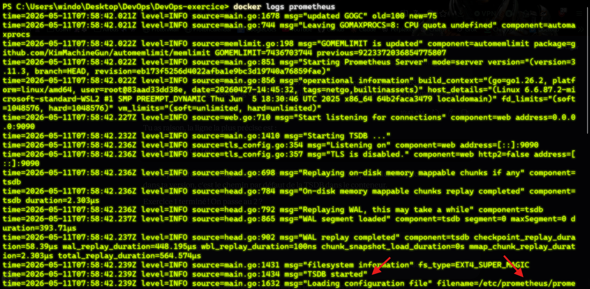

---

## Exercice 2 : Écrire votre premier prometheus.yml

> *Remplacer la configuration par défaut par votre propre prometheus.yml. Définir un intervalle de scrape global de 10s, un external label environment=lab, et recharger Prometheus sans le redémarrer.*

### 2.1 Arrêter le conteneur précédent : docker rm -f prometheus

Comme énoncé, nous tapons `docker rm -f prometheus`.

Pur vérifier la bonne suppression, nous tapons `docker ps` et pouvons voir que `prometheus` n'est plus affiché, il est donc bien arrêté.

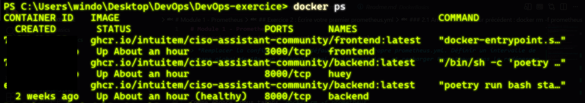

---

### 2.2 Créer un fichier prometheus.yml sur l'hôte avec les paramètres demandés

On crée le fichier :

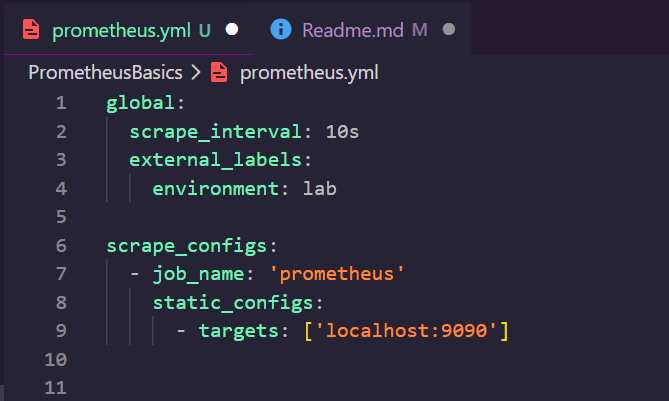

---

### 2.3 Lancer un nouveau conteneur avec --web.enable-lifecycle et le fichier monté sur /etc/prometheus/prometheus.yml

On utilise la commande suivante : `docker run -d --name prometheus -p 9090:9090 -v <PATH_OF_FILE>:/etc/prometheus/prometheus.yml prom/prometheus:latest --config.file=/etc/prometheus/prometheus.yml --web.enable-lifecycle` 

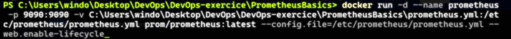

Pour vérifier, on tape `docker ps` et on voit que le container a bien été crée et est bien en mode runing.

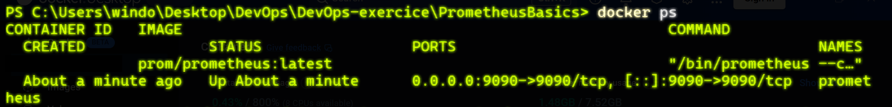

---

### 2.4 Modifier le fichier puis déclencher un rechargement : curl -X POST http://localhost:9090/-/reload

J'ai modifié le fichier en changeant le paramètre `scrape_interval` pour le passer de 10s à 15s :

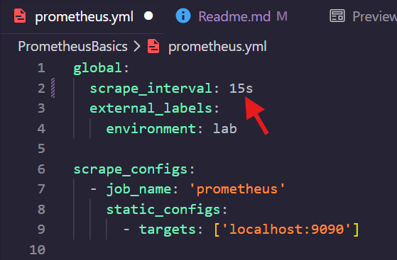

Puis, j'ai reload le fichier de config avec la commande donnée : 

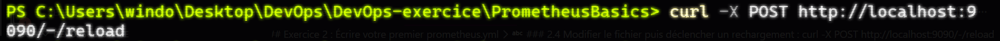

---

### 2.5 Confirmer la modification dans Status > Configuration

On peut voir que la modification a bien été prise en compte :

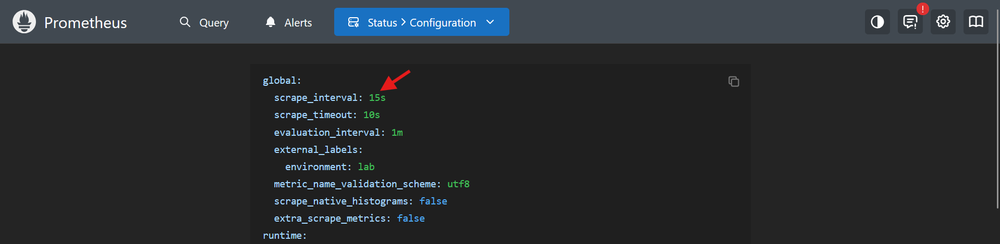

---

## Exercice 3 : Ajouter node_exporter et scraper les métriques système

> *Lancer node_exporter et configurer Prometheus pour le scraper. Vérifier que la métrique node_cpu_seconds_total apparaît dans l'expression browser.*

### 3.1 Lancer node_exporter : docker run -d --name node-exporter -p 9100:9100 prom/node-exporter:latest

