# Partie 1 — Les bases 🟢

## Exercice 1 — Premier contact avec Docker 

### 1.1 __Téléchargez l'image nginx:alpine depuis Docker Hub sans lancer de conteneur.__

Pour ce faire, nous utilisons Docker Desktop et allons dans l'onglet docker Hub puis, dans la barre de recherche nous tapons `nginx`. Il nous propose plusieurs versions, nous prenons la plus récente.

---

### 1.2 __Lancez un conteneur nginx:alpine nommé mon-nginx en arrière-plan, en exposant le port 8080 de votre machine sur le port 80 du conteneur.__

L'idée ici est de runner le container avec l'image précédente et la nommer "mon-nginx" puis de cliquer sur le bouton `Run`

---

### 1.3 __Vérifiez que le conteneur tourne. Quelle commande permet de lister uniquement les conteneurs en cours d'exécution ?__

On peut trouver facilement la commande qui permet de liser uniquement les ocnteneurs en cours d'exécution. La commande qui permet cela est `docker ps`

---

### 1.4 __Ouvrez `http://localhost:8080` dans votre navigateur (ou avec curl ). Que voyez-vous ?__

Nous pouvons voir une page Nginx prouvant que le conteneur Docker est bien lancé et que le serveur web Nginx fonctionne correctement à l'intérieur.

---

### 1.5 __Affichez les logs du conteneur mon-nginx.__

Les logs sont accessibles en cliquant directement sur le nom du container. 

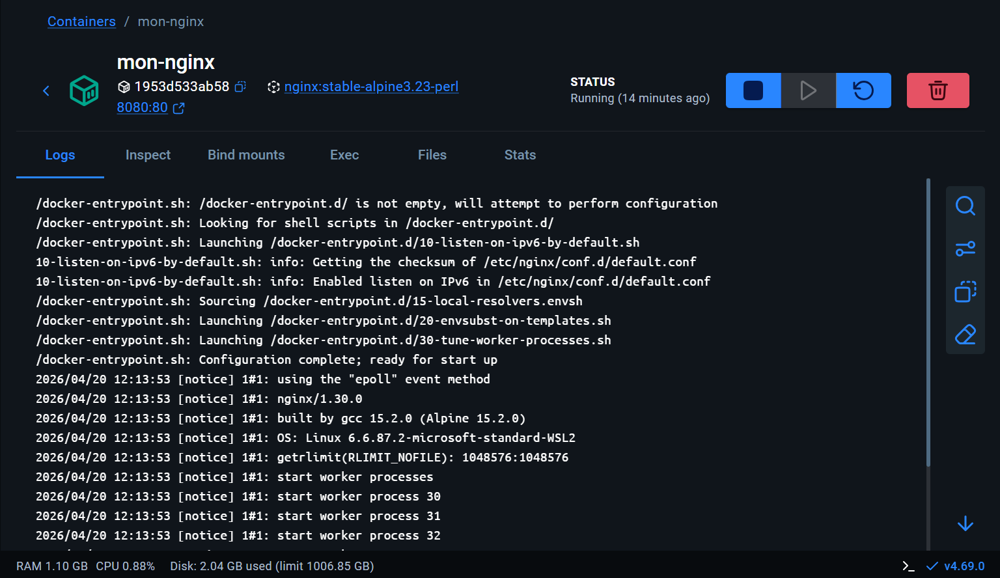
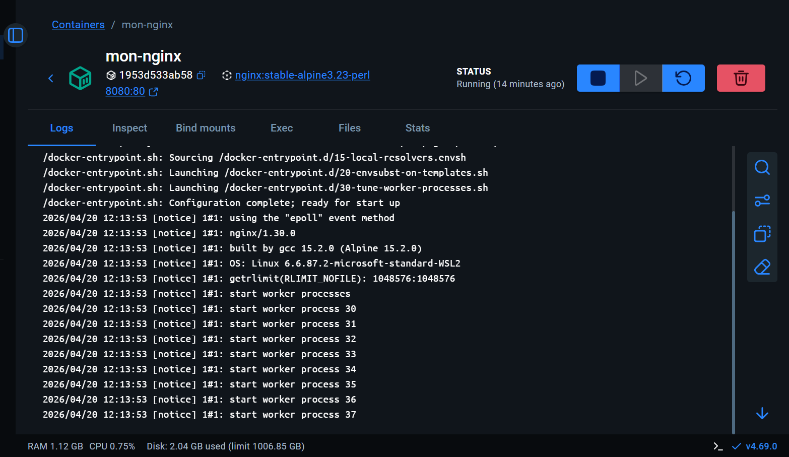

---

### 1.6 __Arrêtez le conteneur mon-nginx sans le supprimer. Puis listez tous les conteneurs (y compris arrêtés). Quelle est la différence avec la commande de la question 1.3 ?__

Pour arrêter le container, nous tapons dans le terminal `docker stop mon-nginx`. Pour vérifier `TOUS` les containers, y compris ceux qui sont arrêtés, comme la commande suite à la question 1.3, nous pouvons trouver cette dernière rapidement suite à une recherche web. Nous devons ajouter le paramètre `-a` dans la commande. Cela donne `docker ps -a`. 

---

### 1.7 __Supprimez le conteneur mon-nginx . Vérifiez qu'il n'existe plus.__

La commande `docker rm mon-nginx` permet de supprimer le container. On vérifie en tapant la commande vue précédemment : `docker ps -a`. On peut voir qu'aucuns containers ne s'affiche, ce dernier a bien été supprimé.

---

### 1.8 __Quelle commande aurait permis de lancer le conteneur de façon à ce qu'il soit automatiquement supprimé à l'arrêt ?__

La commande qui permet de lancer un container puis qu'il se supprime automatiquement une fois stoppé est : `docker run --rm <image>`

## Exercice 2 — Construire sa première image avec un Dockerfile 

### 2.1 __Écrivez index.html avec le contenu HTML minimal suivant (titre : "Ma première image Docker" , un `h1` avec votre prénom).__

A des fins de praticité, dans VSCode il suffira de taper `!` afin qu'il nous ajoute automatiquement un squelette de base avec toutes les balises minimales `HTML`. Nous n'avons plus qu'à remplir le `title` et créer le `H1` dans le `body`.

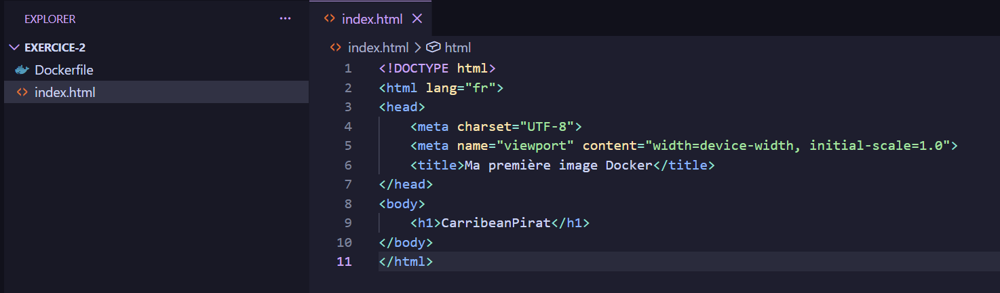

---

### __2.2 Écrivez un Dockerfile qui :__
- __Part de l'image nginx:alpine__
- __Copie index.html dans /usr/share/nginx/html/index.html__
- __Expose le port 80__

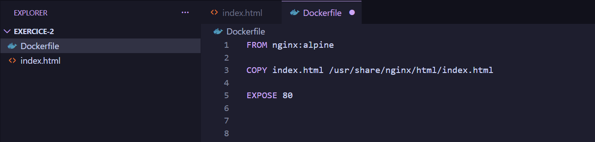

---

### 2.3 __Construisez l'image avec le tag mon-site:v1.__

On rentre la commande `docker build -t <tag> .` dans le terminal.

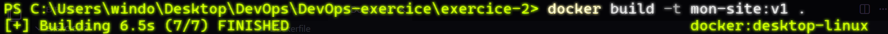

--- 

### 2.4 __Lancez un conteneur basé sur cette image, en exposant le port 9090 → 80 , avec --rm . Vérifiez dans le navigateur.__

Pour ce faire, nous utilisons la commande suivante : `docker run --rm -d -p 9090:80 --name mon-site mon-site:v1`

Après vérification dans le navigateur, nous pouvons voir que le `H1` de notre fichier `HTML` s'exécute correctement.

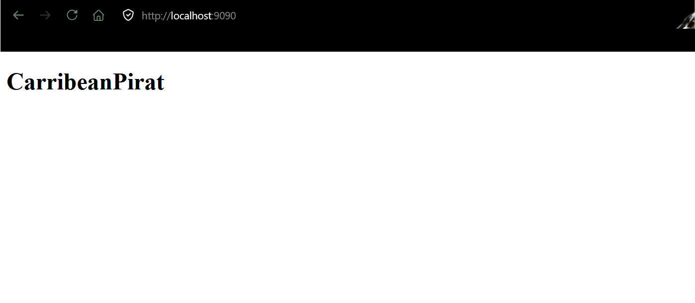

---

### 2.5 __Listez les images locales. Quelle est la taille de mon-site:v1 ? Comparez avec nginx:alpine.__

On peut lister les images avec `docker images`. Avec cette commande, nous avons accès à plusieurs informations dont la taille. `mon-site:nginx` est plus légère que `nginx:alpine` de plusieurs dizaine de MB ce qui est plutôt significatif.

---

### 2.6 __Inspectez les layers de l'image avec `docker history mon-site:v1`. Combien de layers ont été ajoutés par rapport à l'image de base ?__

On peut voir que __2 layers__ on été ajoutés par rapport à l'image de base. `EXPOSE` et `COPY`.

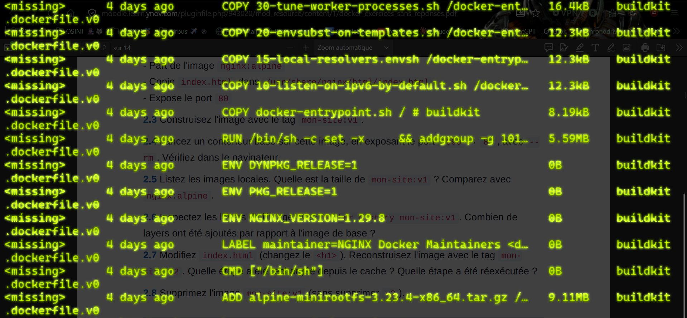

---

### 2.7 __Modifiez `index.html` (changez le `<h1>` ) Reconstruisez l'image avec le tag `mon-site:v2`. Quelle étape a été rechargée depuis le cache ? Quelle étape a été réexécutée ?__

Après avoir modifié le `H1` du fichier `index.html` on reconstruit l'image en tapant la même commande que précédement mais en remplaçant le nom : `docker build -t mon-site:v2`

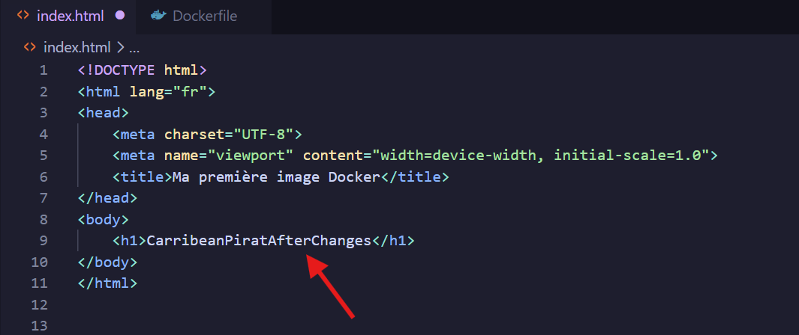
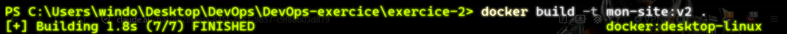

L'image de base nginx:alpine n'a pas changé. Docker réutilise le cache. 

Le fichier index.html a été modifié et Docker a réexécuté le COPY.

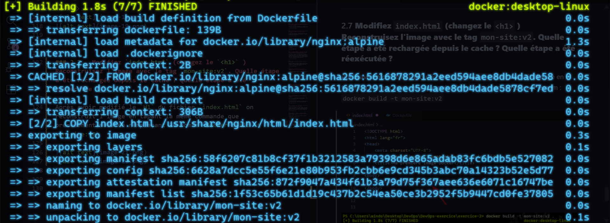

---

### 2.8 __Supprimez l'image mon-site:v1 (sans supprimer v2 ).__

Pour supprimer l'image `mon-site:v1` nous faisons `docker rmi mon-site:v1`.

---

## Exercice 3 — Volumes et persistance des données

### 3.1 __Lancez un conteneur alpine en mode interactif ( -it ) avec --rm . À l'intérieur, créez le fichier /data/test.txt avec le contenu "bonjour" . Quittez ( exit ). Relancez un nouveau conteneur alpine . Le fichier existe-t-il ? Expliquez pourquoi.__

On lance le container avec la commande `docker run -it --rm alpine`. Docker va télécharger automatiquement l'image depuis la librairie. Une fois terminé, nous accédons au shell dans lequel nos pouvons entrer les commandes et créer notre fichier `test.txt`.

Comme nous pouvons le constater, après avoir quitté le container et relancé ce dernier, le dossier `data` n'existe plus car Docker, de base, repart sur une image vierge si on ne lui précise pas que l'on peut faire persister les données.

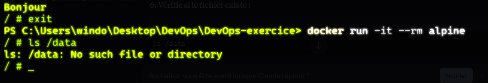

---

